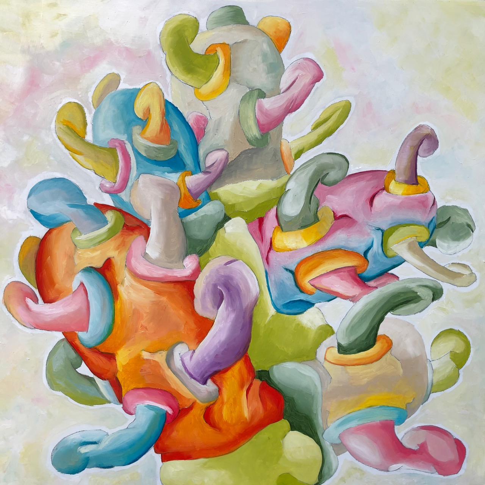

```{r setup, include=FALSE}
knitr::opts_chunk$set(warning = FALSE, message = FALSE, echo=FALSE)
```

## Cactus things

I've always wanted to come back to a series on cactus like things. I've always liked cactuses (cacti?). Mainly, because of how they grow out of themselves in interesting ways. The piece that started this direction I called "Orgplantic land" from the superland collection:

```{r}
knitr::include_graphics("img/Series1/Superland - 1 of 19 (10).jpg")
```

Even though I've put plant like structures similar to these ones in other paintings, I've wanted to make a whole bunch more. Just to see what they look like. 

The newest example is called "Cactus growing out of itself", which I made a month ago. Interesting for me to see how my color palette has changed over the years. Much more pastel. And, I got rid of the thick black lines.

```{r}

```

I did a couple gouache and marker plant pieces, let's see if I can find some of them:

```{r, echo=F, results='asis', message=FALSE}
library(exifr)
library(knitr)
library(slickR)
files <- list.files("img/blog/cactuses")
files <- paste("img/blog/cactuses/",files, sep="")

dat <- read_exif(files)

slickR(files, height='200px',width="100%",
       slickOpts = list(
         initialSlide = 1,
         slidesToShow = 1,
         focusOnSelect = T,
         dots = T
       ))
#for(i in 1:length(files)){
#  cat("", sep="")
#}
```

What will the next cactus like thing look like? Only time will tell. I expect that as I progress, the cactuses will turn into spaceships that fly off into the distance, with a landscape of cactuses that are growing into spaceships, also with towns and hills, and mountains in the background, a sun somewhere, and possibly an ocean, with the occasional dinosaur, or blob like creature. I've seen this before somewhere, I just want to do the same thing differently.

```{r}
knitr::include_graphics("img/desertland/Off to work.jpg")
```


## Summer plans

2019-05-27, last compiled: `r Sys.Date()`

I'm planning to do some painting this summer (2019). I guess I'll blog about it to keep the motivation up.

